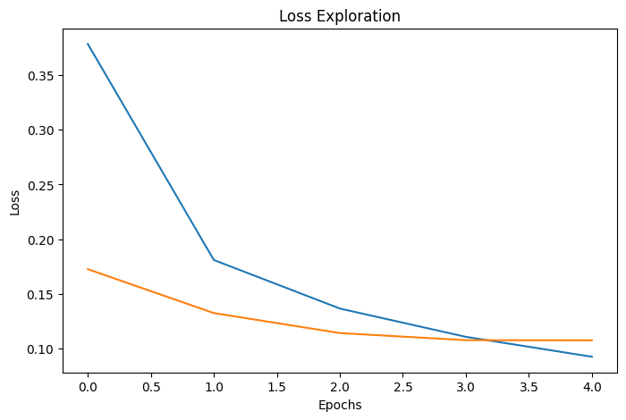
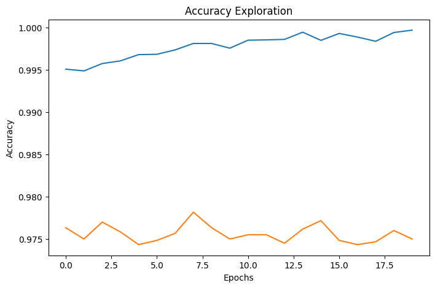
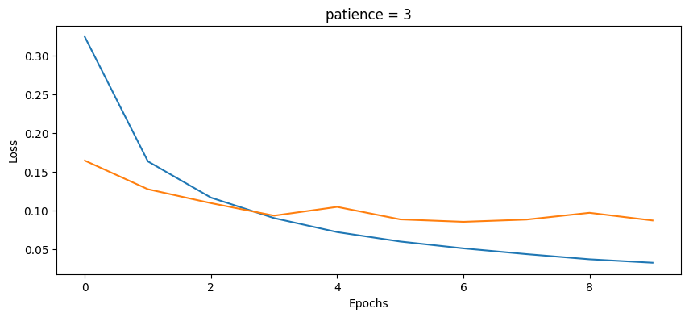
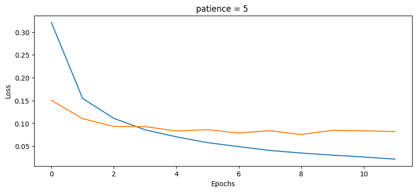
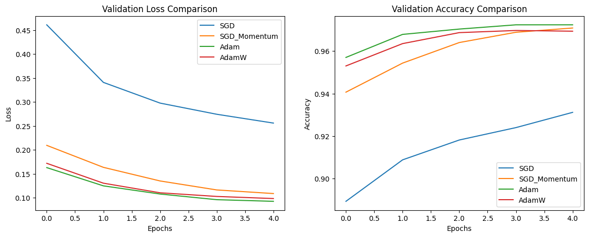

# Mnist-Dataset-Project
The MNIST number classification model involves building the model, conducting tests and challenges on it, and improving deep learning through testing enhancers, activation functions, and many hyperparameters.

---

## 📂 Project Structure & Directory Layout

```text
mnist_project/
├── notebook.ipynb                # Complete code, training loops, and experiments
├── README.md                      
├── results/                      # Generated visual metrics and prediction outputs
│   ├── predictions/              # Custom images and sample inference plots
│   └── loss_curves/              # Learning curves for epochs, batch sizes, & activations
└── submission/                   # Individual documentation for Tasks 01 to 09
    ├── Task01_PredictionAnalysis.md
    ├── Task02_CustomDigit.md
    ├── Task03_Epochs.md
    ├── Task04_EarlyStopping.md
    ├──Task07_Optimizers.md
    ├──Task08_BatchSize
    └── Task09_Activations.md
```
---
# 📔 Notebook Architecture and Sections

---

### 🔹 Section 1: Data Preprocessing & Pipeline Setup
* **Dataset Ingestion:** Loading the raw MNIST benchmark dataset.
* **Normalization:** Scaling and normalizing pixel intensities from `[0, 255]` to the `[0, 1]` range for stable gradient descent.
* **Data Partitioning:** Reshaping and splitting the dataset into distinct **Training**, **Validation**, and **Testing** sets to ensure unbiased evaluation.


### 🔹 Section 2: Baseline Model Architecture & Training
* **Backbone Design:** Designing the core network backbone (Architecture definition).
* **Model Compilation:** Building the network initialized with baseline hyperparameters (learning rate, optimizer, loss function).
* **Evaluation Baseline:** Training the baseline model and establishing initial performance metrics (Accuracy, Precision, Recall, Loss curves).


### 🔹 Section 3: Optimization Challenges & Experimental Ablation Studies
* **Advanced Preprocessing:** Implementation of custom image preprocessing via **OpenCV contour analysis** and **dilation** to improve feature extraction.
* **Robustness Testing:** Conducting stress tests and identifying edge-case challenges where the baseline model fails.
* **Hyperparameter Tuning & Ablation:** Enhancing deep learning performance through systematic ablation studies—testing different optimizer enhancers, activation functions (e.g., ReLU vs. LeakyReLU), and tuning crucial hyperparameters.
---
## How to Run :

1.  **Environment**: Open in Google Colab . 

2.  **Dependencies**: Run the first cell to import tensorflow, cv2, and matplotlib
3.  **Data**: The MNIST dataset loads automatically via Keras. For the Custom Test, ensure your image is uploaded to Drive.
4.  **Execution**: Select **Runtime > Run All**.

---

## 📊 Samples of results (images/plots)

|  Task | Visual Result (Plot) |
| :--- | :---: |
| **Task 02: Custom Image Generalization** <br><br> Testing the network's boundary limits using an external hand-drawn digit processed via contour centering and dilation. |  |
| **Task 03: Learning Curves Exploration** <br><br> Loss and accuracy profiles illustrating structural patterns and stability limitations during 5, 10, and 20 epochs. |  <br>  |
| **Task 04: EarlyStopping Behavior** <br><br> Monitoring training termination dynamic limits using multiple patience setups ($p=3$ vs. $p=5$). |  <br>  |
| **Task 07: Optimizer Comparison Challenge** <br><br> Evaluating how different optimization strategies (SGD, Momentum, Adam, AdamW) traverse the complex loss landscape. |  |
| **Task 09:  Activation function copmare** <br><br> Benchmarking the mathematical gating and validation accuracy properties of ReLU, Tanh, Softsign, and GELU. |  |
